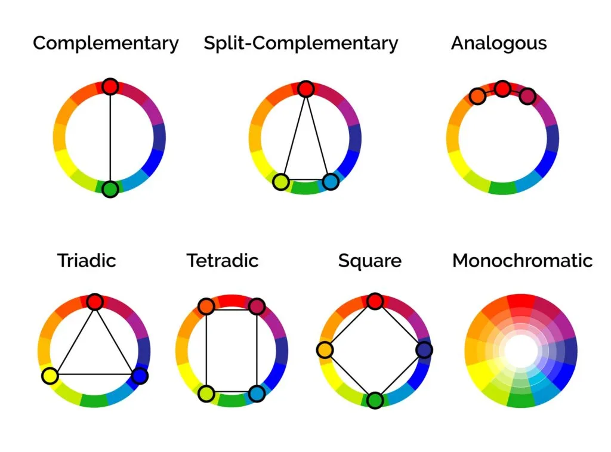

# palettable

The idea behind this game is that it's like Scrabble, but instead of individual letters on squares, each square is a color, and the goal is for you to make the most harmonious color palette with the options in your hand, adding to existing colors on the board. Instead of bonus letters on the board, there would be predetermined colors and players will be rewarded with bonus points for utilizing them. Palettes and color combinations based on theories in color harmony will determine the scoring system. 

Based on the image below, these are the color harmonies I want to start with:
- Analogous colors: side by side on the color wheel
- Complimentary colors: opposite each other on the color wheel
- Split complimentary
- Triad colors
- Tetradic colors: can be square or rectangle
- Monochromatic 

Different colors might have different point values associated with them (i.e., primaries vs secondaries vs tertiaries); different color harmonies could also have different point values. 
